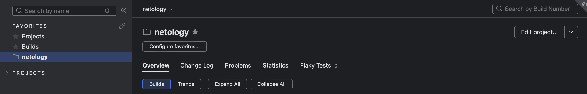
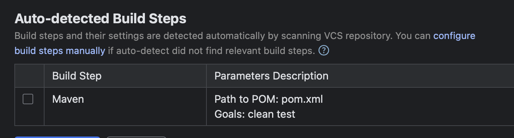
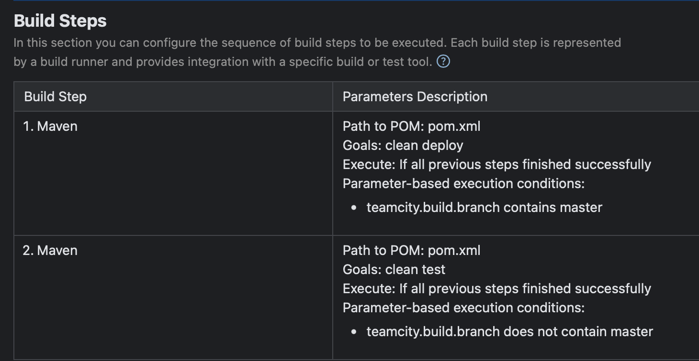
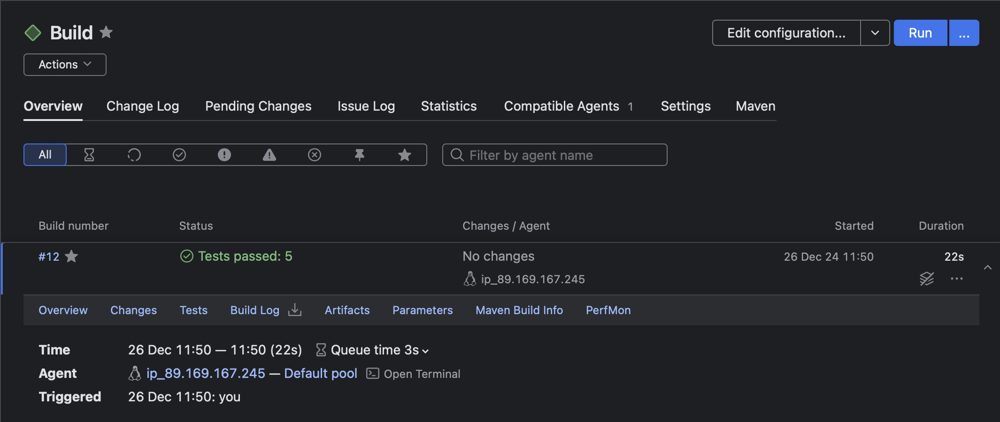
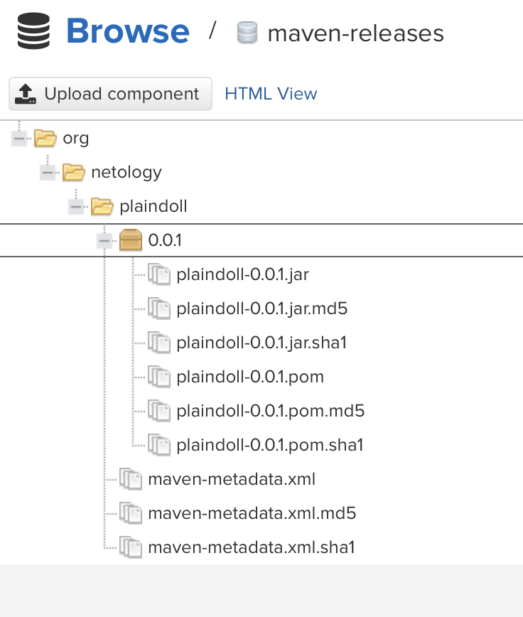
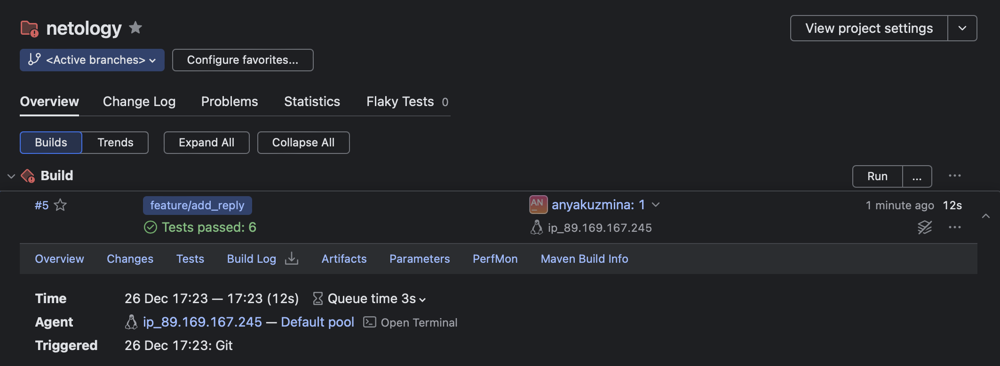

# Домашнее задание к занятию 11 «Teamcity»

## Основная часть

1. Создала проект netology

2. 

3. Успешно 

4. 

5. Добавила [settings.xml](.teamcity/pluginData/_Self/mavenSettings/settings.xml)

6. Поменяла значения в [pom.xml](./pom.xml)

7. 

8. [Конфигурация](.teamcity/)

9. Создала новую ветку

10. Добавила новый метод в [Welcomer.java](./src/main/java/plaindoll/Welcomer.java)

11. Добавила тест в [WelcomerTest.java](./src/test/java/plaindoll/WelcomerTest.java)

12. Запушила все изменения 

13. 

14. Сделала

15. Все ок

16. Настроила [settings](.teamcity/settings.kts)

Все успешно
